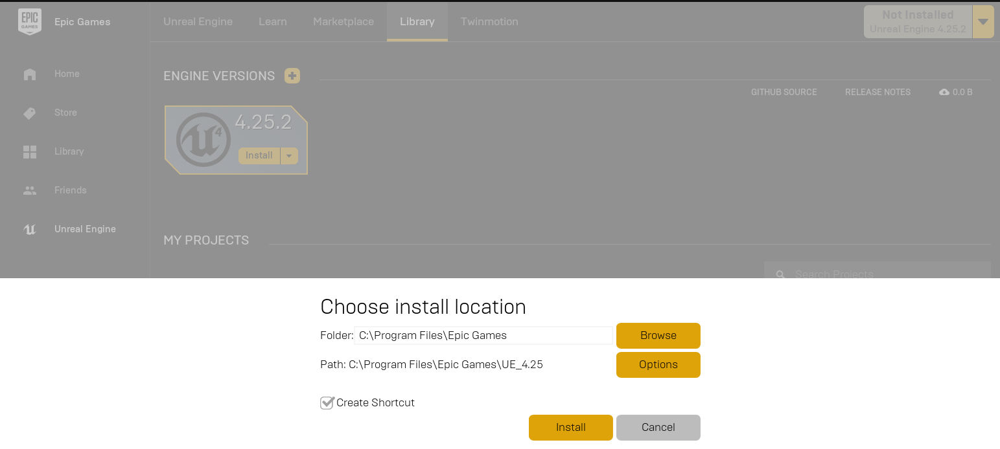

# Build AutonomySim on Windows

## Install Unreal Engine 5

1. [Download](https://www.unrealengine.com/download) the Epic Games Launcher. Although Unreal Engine (UE) is [open-source](https://docs.unrealengine.com/5.3/en-US/downloading-unreal-engine-source-code/), registration is required to access the source code on GitHub. To do so, you will need to be accepted into the Epic Games organization.
2. Run the `Epic Games Launcher` program.
3. If this is the first time you have installed Unreal Engine, click on the big yellow button at the top-right of the main window and select `Install Engine`. Skip ahead to step 7.
4. Otherwise, select `Unreal Engine` on the left window pane.
5. Select the `Library` tab at the top of the main window.
6. Click on the `+` button next to `ENGINE VERSIONS` at the top-left to install a new engine version.
7. Select the desired engine version (e.g., 5.3.2) by clicking the down-arrow next to the version number.
8. Click the `Install` button below the version number.
9. If you have multiple versions installed, click the down-arrow next to the version number and select `Set Current`.

Congratulations! Unreal Engine is now installed and ready to use.

NOTE: If you created projects with UE 4.16 or older, see the [upgrade guide](unreal_upgrade.md) to upgrade your projects.

## Install Visual Studio 2022

* [Download](https://visualstudio.microsoft.com/thank-you-downloading-visual-studio/?sku=Community&channel=Release&version=VS2022) the Visual Studio (VS) 2022 installer
* Install Visual Studio 2022 with the following optional **Workloads**:
  * .NET desktop development
  * Desktop development with C++
  * Universal Windows Platform development
  * Game development with C++
* For the **Game development with C++** Workload, ensure the following are selected to install:
  * C++ profiling tools
  * C++ AddressSanitizer
  * Windows 10 SDK (10.0.18362 or Newer)
  * Unreal Engine installer 

## Build AutonomySim from Source

* Open Visual Studio 2022
* Open **one** of the below VS developer shell environments, depending on your preferred language:
  * `Tools > Command Line > Developer Command Prompt`
  * `Tools > Command Line > Developer PowerShell`
* Ensure you have CMake version 3.14 or greater installed:
  * `cmake --version`
  * If not, [download](https://cmake.org/download/) and install the latest CMake.
* Clone the AutonomySim git repository:
  * `git clone https://github.com/nervosys/AutonomySim.git`
* Enter the AutonomySim directory:
  * `cd AutonomySim`
* Run **one** of the below build scripts from the command line, depending on your preferred language. This script generates ready-to-use Unreal Engine Plugin components in the `Unreal\Plugins` directory, which can be copied into any Unreal project.
  * `.\scripts\build.cmd`
  * `.\scripts\build.ps1`
  * `./scripts/build.sh`

NOTE: We are actively porting the DOS-era Windows batch (.bat) and command (.cmd) scripts to PowerShell (.ps1), as it offers modern features such as cross-platform support, unicode text encoding, and system object piping. Linux and MacOS benefit from supporting a common language, BASH. While MacOS now uses Zsh for its default shell, it is backwards compatible with BASH. Eventually, we may only support PowerShell or BASH (or maybe [Batsh](https://github.com/batsh-dev-team/Batsh)) on all platforms.

NOTE: Installing AutonomySim on the `C:\` drive may cause scripts to fail and may also require running VS in Admin mode. If possible, clone the project into a directory on a different drive. If not, ensure correct behaviour.

## Build an Unreal Project

Next, you will need an Unreal project to host an environment for your vehicles. Close and re-open `Unreal Engine` and `Epic Games Launcher` before building your first environment. After restarting `Epic Games Launcher`, it may ask if you want to associate Unreal project files with `Unreal Engine`. Click on `fix now` to do so. While AutonomySim includes the pre-built `Blocks` environment, you can also create new environments. For more information, see the [Unreal environment setup guide](unreal_proj.md) or learn more about these virtual worlds on the Epic Games website [here](https://docs.unrealengine.com/5.3/en-US/building-virtual-worlds-in-unreal-engine/).

## Setup a Remote Control

NOTE: The below only applies to multi-rotor drones.

To fly drones manually, a physical (or software-emulated) controller is required. For more information, see the [remote control setup guide](remote_control.md). Alternatively, you may (a) wrap [application programming interfaces (APIs)](apis.md) calls for software control or (b) use the [computer vision mode](image_apis.md) for manual keyboard control.

## How to Use AutonomySim

Once AutonomySim is set up by following above steps, you can,

1. Double click on .sln file to load the Blocks project in `Unreal\Environments\Blocks` (or .sln file in your own [custom](unreal_custenv.md) Unreal project). If you don't see .sln file then you probably haven't completed steps in Build Unreal Project section above.

    **Note**: Unreal 4.27 will auto-generate the .sln file targetting Visual Studio 2019. Visual Studio 2022 will be able to load and run this .sln, but if you want full Visual Studio 2022 support, you will need to explicitly enable support by going to 'Edit->Editor Preferences->Source Code' and selecting 'Visual Studio 2022' for the 'Source Code Editor' setting.

2. Select your Unreal project as Start Up project (for example, Blocks project) and make sure Build config is set to "Develop Editor" and x64.
3. After Unreal Editor loads, press Play button. 

!!! tip
    Go to 'Edit->Editor Preferences', in the 'Search' box type 'CPU' and ensure that the 'Use Less CPU when in Background' is unchecked.

See [Using APIs](apis.md) and [settings.json](settings.md) for various options available.

# AutonomySim on Unity (Experimental)
[Unity](https://unity3d.com/) is another great game engine platform and we have an **experimental** integration of [AutonomySim with Unity](Unity.md). Please note that this is work in progress and all features may not work yet.
